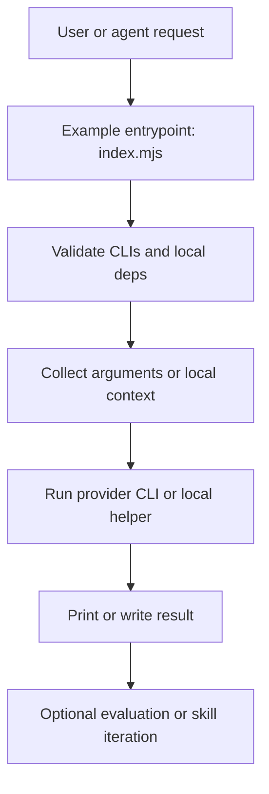

# Architecture

## Overview

`zx-harness` is not a framework. It is a repeatable shape for small agent-oriented scripts.

Main building blocks:

- `zx` entrypoints
- local Node.js or TypeScript helpers
- direct shell commands
- external CLIs as provider backends
- skills and evaluations as feedback loops

## System Shape

## Layers

### Entrypoint layer

Each runnable example starts at `index.mjs`.

Typical responsibilities:

- set `zx` shell behavior
- parse arguments
- validate required binaries
- delegate to local helper files when needed

### Example-local layer

When an example needs more than one file, the extra files stay inside that example folder.

Typical local assets:

- prompt files
- TypeScript helpers
- package manifests
- temporary run output

### External dependency layer

Examples call external CLIs directly instead of hiding them behind a large internal API.

Common dependencies in this repo:

- `gh`
- `copilot`
- `codex`
- `git`
- `node`
- `npm`

### Skill layer

`skills/` stores authoring guidance that helps agents generate examples in the same style.

### Evaluation layer

`evaluations/` measures or evolves skill quality without changing the basic repository shape.

## Design Constraints

- one example per directory
- `index.mjs` is the runnable entrypoint
- examples verify required CLIs before real work
- example assets stay local to the example directory
- output-facing text stays in English
- examples stay small unless complexity is required

## Example Shapes

### Thin wrapper

Use this when one command is enough.

Examples:

- `hello-world`
- `hello-name`
- `hello-cop`

### Wrapper plus local helper

Use this when the entrypoint stays small but one or two local files improve clarity.

Examples:

- `gh-involved-repos`
- `gh-issue-knowledge`

### Wrapper plus local package

Use this when the example needs its own dependencies and a small local program.

Examples:

- `copilot-sdk-repo-summary`
- `pi-mono-repo-summary`

## What This Repo Avoids

- central runtime registries
- shared provider abstraction layers before they are proven necessary
- plugin systems before the example contract is stable
- large config-driven orchestration
